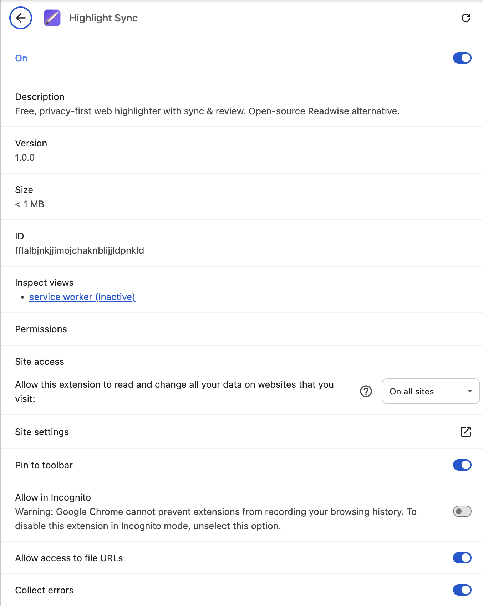
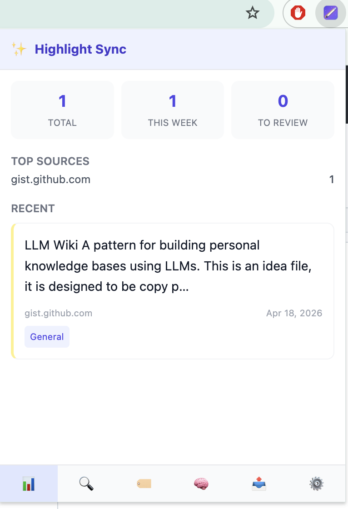
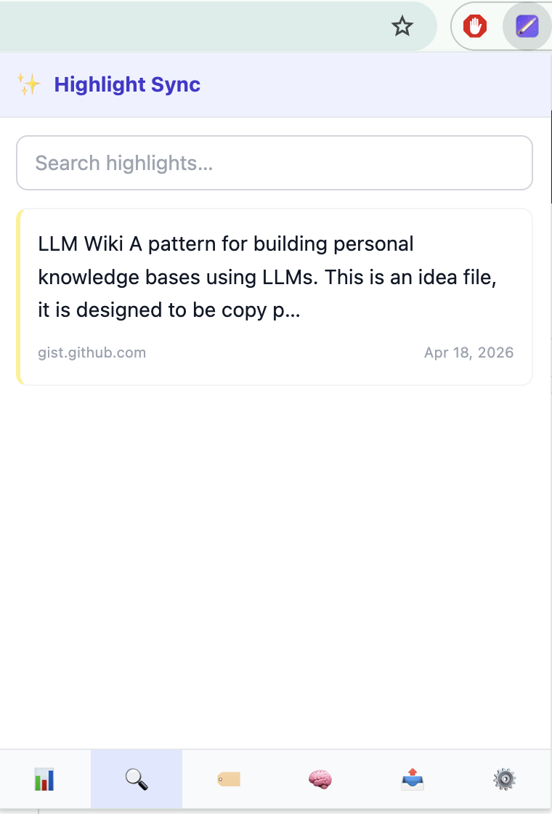
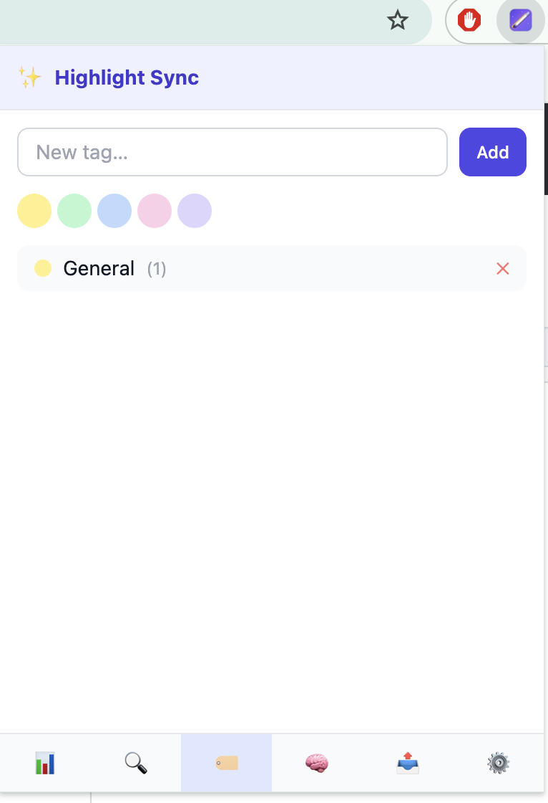
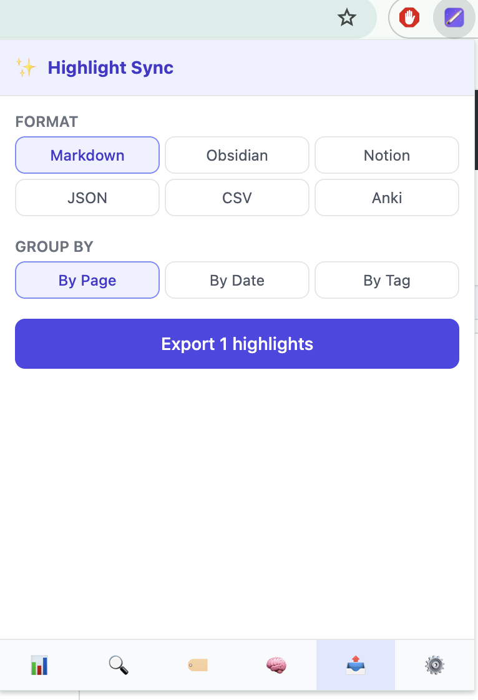
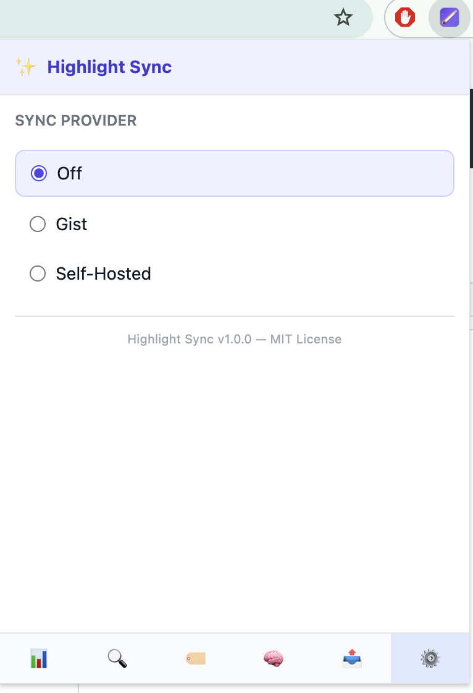

<p align="center">
  
</p>

<h1 align="center">Highlight Sync</h1>

<p align="center">
  Free, privacy-first web highlighter with sync & review.<br/>
  <strong>Open-source Readwise alternative. No cloud required.</strong>
</p>

<p align="center">
  <a href="https://github.com/bhayanak/highlight-sync/actions/workflows/ci.yml"></a>
  <a href="https://codecov.io/gh/bhayanak/highlight-sync"></a>
  
  
  
  
</p>

---

## Features

| Feature | Description |
|---------|-------------|
| **Web Highlighting** | Select text on any page → pick color → auto-save |
| **Local-First Storage** | All data in IndexedDB — no cloud required |
| **Tags & Search** | Tag highlights by topic, full-text search |
| **Spaced Repetition** | Daily review digest using SM-2 algorithm |
| **Multi-Format Export** | Markdown, CSV, JSON, Obsidian, Notion, Anki |
| **Optional Sync** | GitHub Gist (free) or self-hosted endpoint |
| **Cross-Browser** | Chrome + Firefox (Manifest V3) |
| **Privacy-First** | Zero analytics, zero tracking, fully open-source |

## Install

### Chrome Web Store
> Coming soon 

### Firefox Add-ons
> Coming soon 

### Edge Extension
> Coming soon 

Note: Use github release for installing extensions/addons for now.

### Manual Install (Developer Mode)

```bash
git clone https://github.com/bhayanak/highlight-sync.git
cd highlight-sync
pnpm install
pnpm build
```

**Chrome:** `chrome://extensions` → Enable Developer Mode → Load Unpacked → select `dist/`

**Firefox:** `about:debugging#/runtime/this-firefox` → Load Temporary Add-on → select `dist/manifest.json`

## Usage

1. **Highlight text** — Select text on any page → floating color toolbar appears → click a color
2. **Keyboard shortcut** — `Ctrl+Shift+H` (Windows/Linux) or `Cmd+Shift+H` (Mac) to highlight with default yellow
3. **Right-click** — Select text → right-click → "Highlight Selection" → pick color
4. **Search** — Click extension icon → Search tab → type to search across all highlights
5. **Tags** — Click extension icon → Tags tab → create and manage tags
6. **Review** — Click extension icon → Review tab → review highlights with spaced repetition
7. **Export** — Click extension icon → Export tab → choose format and download
8. **Sync** — Click extension icon → Settings tab → configure GitHub Gist or self-hosted sync

## Export Formats

| Format | Details |
|--------|---------|
| **Markdown** | Grouped by page/date/tag with metadata |
| **Obsidian** | Frontmatter YAML, `> [!quote]` callouts, `[[wikilinks]]` |
| **Notion** | Notion-compatible markdown with database properties |
| **Anki** | Tab-separated: front=context, back=highlight |
| **CSV** | Standard CSV with all fields |
| **JSON** | Raw JSON array for custom processing |

## Sync Options

| Provider | How It Works |
|----------|-------------|
| **GitHub Gist** | Stores highlights as JSON in a private gist (free, encrypted PAT) |
| **Self-hosted** | POST/GET to your REST endpoint (HTTPS required) |
| **None** | Fully local — zero network requests |

## Keyboard Shortcuts

| Shortcut | Action |
|----------|--------|
| `Ctrl/Cmd + Shift + H` | Highlight selected text (yellow) |

## Screens
<p align="center">
  
  
</p>

<p align="center">
  
  
</p>

<p align="center">
  
  
</p>


## Comparison

| Feature | Highlight Sync | Readwise ($8/mo) | Liner (Freemium) |
|---------|:---:|:---:|:---:|
| **Price** | Free | $96/year | Free tier limited |
| **Open Source** | ✅ | ❌ | ❌ |
| **Local-First** | ✅ | ❌ | ❌ |
| **No Account Required** | ✅ | ❌ | ❌ |
| **Spaced Repetition** | ✅ | ✅ | ❌ |
| **Obsidian Export** | ✅ | ✅ | ❌ |
| **Anki Export** | ✅ | ❌ | ❌ |
| **Self-hosted Sync** | ✅ | ❌ | ❌ |
| **Privacy-First** | ✅ | ❌ | ❌ |

## Security

- All data stored locally in IndexedDB by default
- GitHub PAT encrypted via WebCrypto API (AES-256-GCM) before storage
- Self-hosted sync enforces HTTPS only
- No `innerHTML` — all DOM operations use safe APIs (`textContent`, `createElement`)
- Strict Content Security Policy
- No analytics, no tracking, no external requests unless sync is enabled
- `eslint-plugin-security` in CI pipeline
- Trivy filesystem scanning + SBOM generation in releases

## Contributing

Contributions are welcome! Please see our [Contributing Guide](docs/CONTRIBUTING.md).

1. Fork the repository
2. Create a feature branch: `git checkout -b feat/my-feature`
3. Commit changes: `git commit -m 'feat: add my feature'`
4. Push: `git push origin feat/my-feature`
5. Open a Pull Request

## License

[MIT](LICENSE) — free to use, modify, and distribute.
